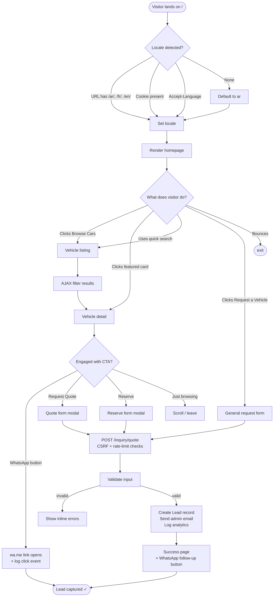
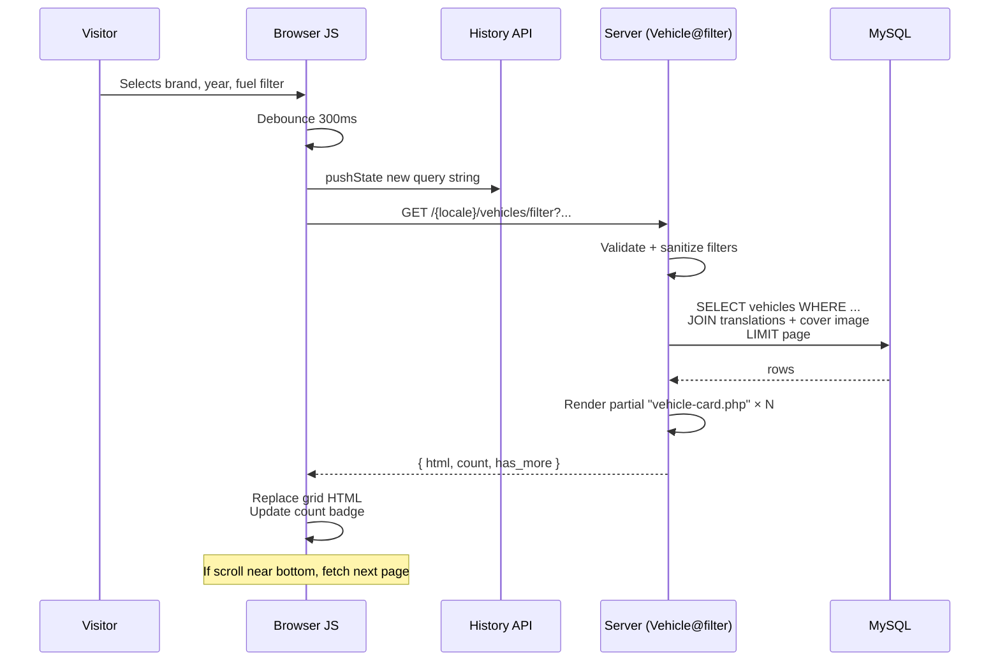
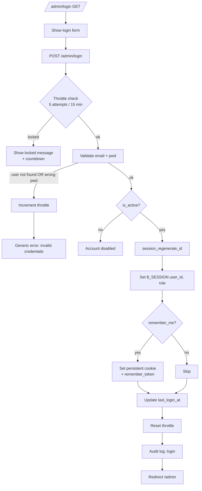
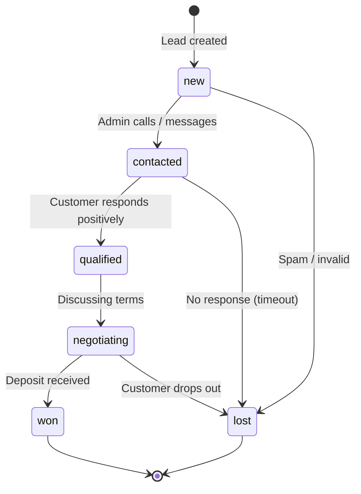
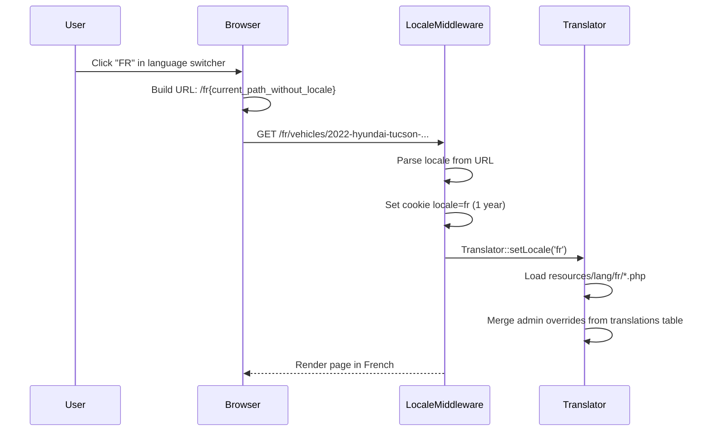

# 05 — Page Flows & User Journeys

All flows use Mermaid syntax. Render in any Mermaid-aware viewer (VS Code preview, GitHub, Notion).

---

## 1. Visitor — Discovery to Lead (the golden path)



## 2. Visitor — Vehicle Detail page deep dive

```mermaid
flowchart TD
    A([/{locale}/vehicles/{slug}]) --> B[Controller@show]
    B --> C[Repository::findBySlug]
    C -- not found --> NF[404 page]
    C -- found --> D[Eager load:<br/>images, videos,<br/>inspection, translation,<br/>brand, model, body_type]
    D --> E[Increment views_count<br/>fire-and-forget]
    E --> F[Build:<br/>SEO meta + JSON-LD Vehicle<br/>Estimator output<br/>WhatsApp prefill<br/>Similar vehicles]
    F --> G[Render view]
    G --> H{Visitor interaction}
    H -- Image click --> I[Open lightbox / fullscreen]
    H -- Thumb click --> J[Swap main image]
    H -- Tab click --> K[Smooth-scroll + active state]
    H -- WhatsApp tap --> WA[Open wa.me<br/>POST /events/whatsapp]
    H -- Quote CTA --> Q[Open quote modal]
    H -- Reserve CTA --> RV[Open reserve modal]
    Q --> POST[Submit lead]
    RV --> POST
    POST --> Done([Lead success ✓])
```

## 3. Visitor — AJAX Vehicle Filtering



## 4. Lead Submission — Server-side flow

```mermaid
flowchart TD
    A[POST /inquiry] --> B{CSRF valid?}
    B -- no --> X1[419 + log]
    B -- yes --> C{Rate limit OK?<br/>5/h per IP}
    C -- no --> X2[429 Too many requests]
    C -- yes --> D[Validator]
    D -- fail --> X3[Re-render form<br/>with errors]
    D -- pass --> E[Honeypot field empty?]
    E -- no --> X4[Silent 200<br/>discard]
    E -- yes --> F[Normalize phone<br/>Hash IP + UA]
    F --> G[LeadService::store]
    G --> H[INSERT leads]
    H --> I[Queue email to admin<br/>(synchronous in v1)]
    I --> J[Log audit_logs]
    J --> K[Redirect to thank-you page]
    K --> END([Done])
```

## 5. Admin — Authentication flow



## 6. Admin — Vehicle creation flow

```mermaid
flowchart TD
    A[/admin/vehicles/create GET/] --> B[Show empty form<br/>brands & models prefetched]
    B --> C[POST /admin/vehicles]
    C --> CSRF{CSRF + auth?}
    CSRF -- fail --> X[403]
    CSRF -- ok --> V[Validate]
    V -- fail --> RB[Re-render with errors]
    V -- ok --> S[Slug generator:<br/>year-brand-model-vin_tail<br/>(uniqueness check)]
    S --> T1[BEGIN TRANSACTION]
    T1 --> T2[INSERT vehicles]
    T2 --> T3[INSERT vehicle_translations × locales]
    T3 --> T4[COMMIT]
    T4 --> R[Redirect to edit page<br/>with success flash]
    R --> E[Edit view, Media tab pre-open]
    E --> U[User uploads images]
    U --> UP[POST /admin/vehicles/{id}/images]
    UP --> IM[ImageProcessor:<br/>validate mime<br/>generate thumb/medium/large<br/>strip EXIF<br/>convert to webp + jpeg]
    IM --> ST[Storage::put → public/uploads/vehicles/{id}/]
    ST --> DB2[INSERT vehicle_images]
    DB2 --> RET[Return JSON: id, url, thumb_url]
    RET --> UI[Append thumb in UI]
```

## 7. Admin — Lead management flow



## 8. Locale switching flow



## 9. SEO indexing flow

```mermaid
flowchart TD
    A[Search engine crawls /sitemap.xml] --> B[Page@sitemap]
    B --> C[Cached?<br/>storage/cache/sitemap.xml]
    C -- yes & fresh < 1h --> D[Stream cached]
    C -- no --> E[Generate:<br/>- static pages × 3 locales<br/>- vehicle pages × 3 locales<br/>- page records × 3 locales]
    E --> F[Write cache]
    F --> D
    D --> G[Crawler hits /ar/vehicles/{slug}]
    G --> H[Vehicle@show renders]
    H --> I[Response includes:<br/>title, meta, OG, hreflang,<br/>JSON-LD Vehicle schema,<br/>canonical]
    I --> J[Search engine indexes]
    J --> K[User Google search]
    K --> L[Rich snippet with image,<br/>price, hours of operation]
```

## 10. Image upload pipeline

```mermaid
flowchart LR
    U[Upload file] --> V{Mime whitelist}
    V -- reject --> E1[Error]
    V -- ok --> S{Size < 10 MB?}
    S -- no --> E2[Error]
    S -- ok --> EX[Strip EXIF<br/>GPS / camera info]
    EX --> R{Re-encode<br/>image/webp<br/>image/jpeg fallback}
    R --> T1[400w thumb]
    R --> T2[800w medium]
    R --> T3[1600w large]
    R --> T4[orig (stored, never served)]
    T1 --> ST[Storage::put]
    T2 --> ST
    T3 --> ST
    T4 --> ST
    ST --> DB[(vehicle_images row)]
    DB --> URL[Public URL via Storage::url]
```

## 11. Page-level data dependencies (cheat sheet)

| Page             | Data needed                                                                | Queries  |
|------------------|----------------------------------------------------------------------------|----------|
| Home             | site settings, 8 featured vehicles, 4 testimonials, page-meta              | 4        |
| Vehicle listing  | brands/models for filters, vehicles page, count                            | 4–5      |
| Vehicle detail   | vehicle+translation, images, videos, inspection, brand, model, similar(4)  | 8–10     |
| Why Korea        | page translation, settings                                                 | 2        |
| Import Process   | page translation                                                           | 1        |
| Testimonials     | testimonials+translations                                                  | 2        |
| Contact          | settings                                                                   | 1        |
| Admin dashboard  | counts, recent leads, popular vehicles, click events agg                   | 4        |
| Admin vehicle ed.| vehicle + relations, brands list, models list, body_types                  | 5        |
| Sitemap          | all published vehicles + pages × locales                                   | 2 (cached)|
